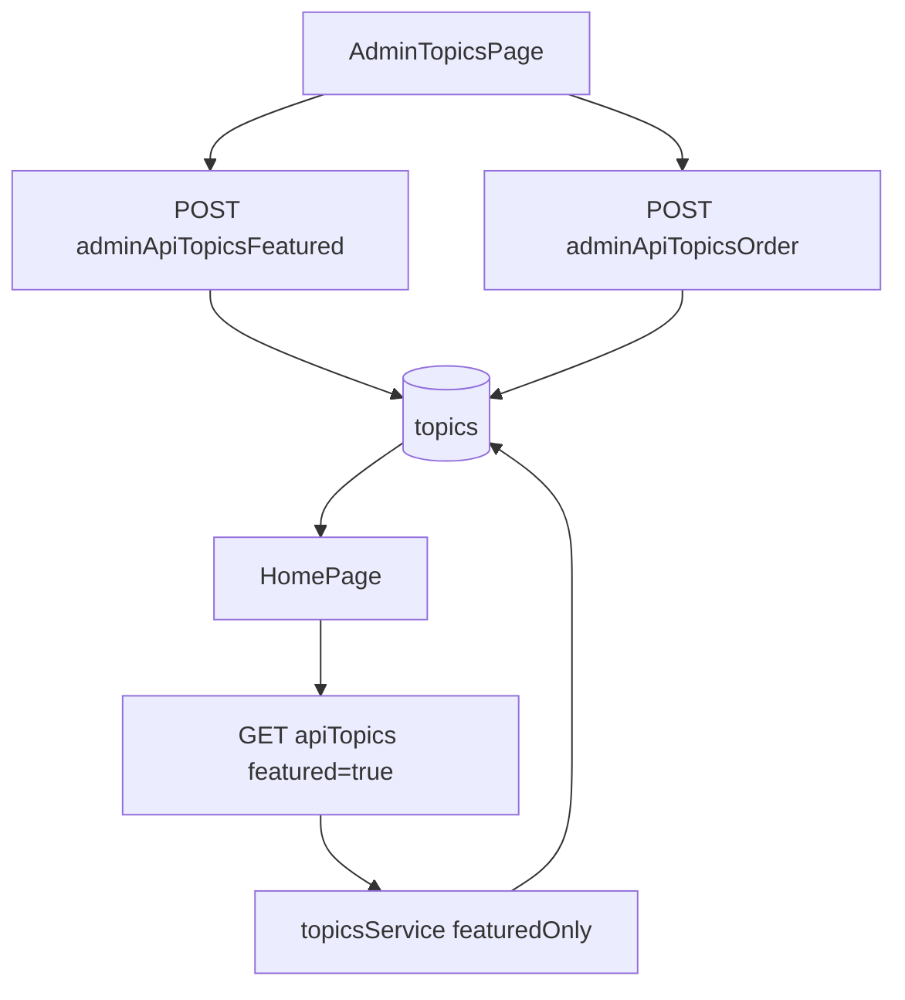

# Featured Topics Ordering - Development Plan

## Overview
Implement a topic-level equivalent of featured questions: admins can feature topics and control their display order; homepage renders only featured topics in that exact order above Featured Debates, with prototype-aligned card interactions and links to each topic page.

## Requirements

### User Story
**As an admin**, I want to feature and order topics so the homepage highlights the most important themes in a deliberate sequence.

### Acceptance Criteria
- Admin can mark/unmark topics as featured.
- Admin can reorder featured topics from admin UI.
- Homepage shows featured topics above Featured Debates.
- Homepage displays featured topics in the exact admin-defined order.
- Each featured topic card links to `/topics/[id]`.
- Featured topic cards use the interaction style established in `_prototype2`.

## Current Baseline

1. Homepage currently displays featured questions only:
   - `apps/web/app/page.tsx`
2. Topic model does not yet contain feature/order fields:
   - `modules/db/prisma/schema.prisma`
3. Admin topics page lacks featured/order controls:
   - `apps/web/app/admin/topics/page.tsx`
4. Existing question endpoints provide a reusable pattern:
   - `apps/web/app/admin/api/questions/featured/route.ts`
   - `apps/web/app/admin/api/questions/order/route.ts`

## Implementation Plan

### Phase 1: Database schema

#### 1.1 Add topic featured fields
**File**: `modules/db/prisma/schema.prisma`

- Add `isFeatured Boolean @default(false)` to `Topic`.
- Add `featuredOrder Int?` to `Topic`.
- Add indexes for efficient filtering/sorting:
  - `@@index([isFeatured])`
  - `@@index([featuredOrder])`

#### 1.2 Create migration
- Generate Prisma migration for `Topic.isFeatured` and `Topic.featuredOrder`.
- Confirm no behavior changes for non-featured topics in admin listing.

### Phase 2: Shared types and topic retrieval

#### 2.1 Extend DTOs
**File**: `modules/shared/src/dto/topics.dto.ts`

- Add optional fields:
  - `isFeatured?: boolean`
  - `featuredOrder?: number | null`

#### 2.2 Add featured filter support to topics service flow
**Files**:
- `apps/web/app/api/topics/route.ts`
- `apps/api/src/services/topicsService.ts`
- `modules/db/src/repositories/topicRepository.ts` (if needed for query efficiency)

**Changes**:
- Accept `featured=true` on public topics endpoint.
- Pass `featuredOnly` through service/repository.
- Sort featured topics by:
  1. `featuredOrder` ascending
  2. fallback `name` ascending

### Phase 3: Admin API for topic featuring and ordering

#### 3.1 Topic featured toggle endpoint
**File**: `apps/web/app/admin/api/topics/featured/route.ts` (NEW)

**Request body**:
```json
{ "id": "topic-id", "isFeatured": true }
```

**Behavior**:
- Validate payload.
- If `isFeatured = true`, set `featuredOrder` to existing value or next max + 1.
- If `isFeatured = false`, set `isFeatured = false` (keep order value optional for audit/history).

#### 3.2 Topic order endpoint
**File**: `apps/web/app/admin/api/topics/order/route.ts` (NEW)

**Request body**:
```json
{ "ids": ["topic-a", "topic-b", "topic-c"] }
```

**Behavior**:
- Update featured order in transaction:
  - `topic-a -> 0`, `topic-b -> 1`, `topic-c -> 2`.

#### 3.3 Enrich admin topics list API
**File**: `apps/web/app/admin/api/topics/route.ts`

- Return `isFeatured` and `featuredOrder`.
- Sort: featured first, then `featuredOrder`, then name.

### Phase 4: Admin UI controls

#### 4.1 Add featured toggle and ordering controls
**File**: `apps/web/app/admin/topics/page.tsx`

**Changes**:
- Add Featured column with toggle switch.
- Add drag-and-drop reordering for featured topics (reuse same DnD pattern from admin questions).
- Persist ordering via `/admin/api/topics/order`.
- Keep non-featured topics visible but outside featured sort behavior.

### Phase 5: Homepage Featured Topics section

#### 5.1 Render section above Featured Debates
**Files**:
- `apps/web/app/page.tsx`
- `apps/web/lib/hooks/useTopics.ts`

**Changes**:
- Fetch with `featuredOnly=true`.
- Add section header and grid above existing Featured Debates section.
- Keep Featured Debates section unchanged below.

#### 5.2 Apply prototype interaction pattern
**Reference**: `_prototype2/pages/Home.tsx`

Apply the same card interaction language:
- hover lift (`translate-y`)
- hover shadow
- smooth transition
- title hover underline

Each featured topic card links to `/topics/${topic.id}`.

## Data Flow



## Testing Plan

### API Tests
- Topic featured toggle endpoint:
  - valid toggle on/off
  - missing payload validation
  - non-existent topic handling
- Topic order endpoint:
  - valid reorder transaction
  - invalid/empty ids validation

### UI Tests
- Admin topics page:
  - toggle featured state
  - reorder featured topics and persist
- Homepage:
  - featured topics render above Featured Debates
  - rendering order matches featuredOrder
  - topic card links point to `/topics/[id]`

### Manual Verification
- Feature at least 3 topics in admin.
- Reorder and refresh admin page; verify persisted order.
- Open homepage; verify order and placement above Featured Debates.
- Verify hover effects match `_prototype2` behavior.

## Risks / Notes
- Topic featuring should be global (multiple topics can be featured concurrently).
- Existing question behavior that unfeatures siblings in same topic should not be copied for topics.
- If future design requires per-topic background colors from DB, scope as a follow-up (`Topic.color`).
