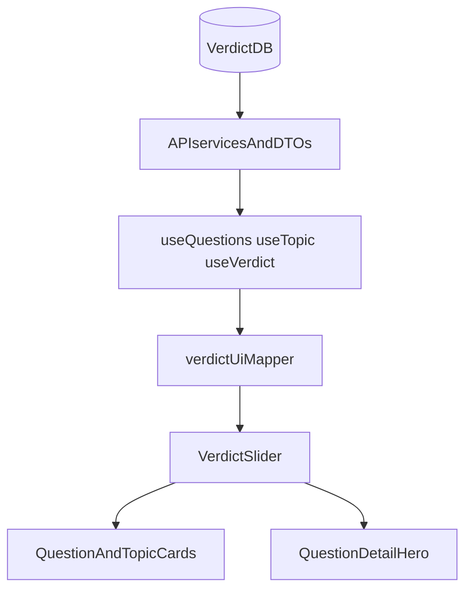

# Verdict Slider UI - Development Plan

## Overview
Implement a separate reusable horizontal verdict slider UI that uses existing verdict data and contracts, mapping `verdictLabel` to fixed horizontal positions. Roll out on card surfaces and question detail hero while preserving current database structure and underlying data.

## Requirements

### User Story
**As a reader**, I want a clear horizontal verdict slider so I can quickly understand where a verdict falls between No and Yes.

### Confirmed Decisions
- Scope: cards and question detail page.
- Mapping: fixed 5-stop mapping from `verdictLabel`.
- Constraint: no DB schema or persisted data changes.

### Acceptance Criteria
- A reusable `VerdictSlider` component exists in the web app.
- Cards and question detail hero render the slider.
- Slider position follows fixed label mapping exactly.
- Existing data model and API contracts remain unchanged.
- Publication alignment section on question detail remains functional.

## Current Baseline

1. Verdict data already available in current APIs/DTOs:
   - `modules/shared/src/dto/verdicts.dto.ts`
   - `apps/api/src/services/verdictsService.ts`
   - `apps/api/src/services/questionsService.ts`
2. Cards currently use verdict text/color only:
   - `apps/web/app/components/QuestionCard.tsx`
   - `apps/web/app/components/TopicCard.tsx`
3. Question detail hero currently uses a blue progress bar:
   - `apps/web/app/questions/[id]/page.tsx`
4. Prototype style reference:
   - `_prototype2/components/VerdictSlider.tsx`

## Implementation Plan

### Phase 1: Build reusable slider component

#### 1.1 Add component
**File**: `apps/web/app/components/VerdictSlider.tsx` (NEW)

**Props**:
- `verdictLabel?: VerdictLabel`
- `size?: 'sm' | 'lg'`
- optional `showPointer?: boolean`
- optional `className?: string`

#### 1.2 Fixed-stop mapping
- `NoItDoesntSeemSo -> 8%`
- `ProbablyNot -> 25%`
- `Unclear -> 50%`
- `ProbablyYes -> 75%`
- `YesItSeemsSo -> 92%`

#### 1.3 Visual behavior
Mirror prototype language:
- red-to-amber-to-green horizontal gradient
- top triangle pointer
- rounded track, section separators, edge labels
- smooth transition animation

### Phase 2: Unify verdict UI mapping helpers

#### 2.1 Create shared helper
**File**: `apps/web/lib/utils/verdictUi.ts` (NEW)

Centralize:
- verdict label display text
- verdict accent color class
- slider position mapping

#### 2.2 Refactor consumers
Replace duplicated switch/case logic in:
- `apps/web/app/components/QuestionCard.tsx`
- `apps/web/app/components/TopicCard.tsx`
- `apps/web/app/questions/[id]/page.tsx`

### Phase 3: Integrate slider on cards

#### 3.1 Question cards
**File**: `apps/web/app/components/QuestionCard.tsx`

- Render `VerdictSlider` in card content.
- Keep current links and metadata behavior unchanged.

#### 3.2 Topic cards
**File**: `apps/web/app/components/TopicCard.tsx`

- Render `VerdictSlider` where verdict summary currently appears.
- Maintain existing card routing and footer metadata.

### Phase 4: Integrate slider on question detail hero

#### 4.1 Replace hero bar
**File**: `apps/web/app/questions/[id]/page.tsx`

- Replace current single blue alignment progress bar in hero with `VerdictSlider`.
- Slider position should use `verdictLabel` mapping.

#### 4.2 Keep alignment subsection intact
- Do not change the "Journalist Alignment" per-publication bars in this phase.
- Adjust hero wording as needed so it does not imply slider value is computed outlet alignment.

### Phase 5: Testing and validation

#### 5.1 Component tests
- Validate each verdict label maps to expected position.
- Validate fallback rendering for missing label.

#### 5.2 Integration checks
- Cards show slider on homepage/topic pages.
- Question detail hero shows slider.
- Existing alignment section still renders and computes as before.

#### 5.3 Manual QA
- Verify visual parity with `_prototype2` interaction style.
- Verify responsive behavior in small and large viewports.
- Verify no regressions in links/navigation from cards.

## Data & Compatibility Guarantees
- No Prisma schema changes.
- No migrations.
- No DB scripts required.
- No API contract changes.
- Existing `verdictLabel` remains source of truth for slider state.

## Data Flow

## Risks / Notes
- Existing hero copy references "alignment"; if slider is label-based, copy should avoid mismatched semantics.
- Since slider is categorical, confidence can remain as supplementary text if additional numeric nuance is needed.
