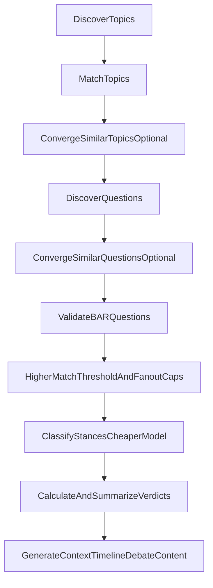

# Pipeline Low-Effort Improvements - Development Plan

## Overview
Apply low-effort, high-impact optimizations to the existing article analysis pipeline by adding earlier gating, reducing duplicate work, tightening classification prefilters, and routing non-generative LLM checks to cheaper models. Keep the current command sequence intact while lowering unnecessary pair expansion and LLM spend.

## Requirements

### User Story
**As an operator**, I want to keep the existing pipeline flow but insert practical cost and quality controls so we classify fewer low-value pairs and spend less on non-generative LLM calls.

### Acceptance Criteria
- Existing command order remains the baseline run order.
- Topic/question convergence gates are included before stance classification.
- Classification prefilter confidence is raised with an override option.
- Practical fanout caps are applied before classification.
- N+1 question lookups in classification paths are removed.
- Non-generative checks are routed to a cheaper model tier.
- Pipeline observability includes pair-count/cost projections and rejection funnel metrics.

## Current Baseline

Current command order (kept):
1. `npm run db:discover:topics`
2. `npm run crawler:match-topics`
3. `npm run db:discover:questions`
4. `npm run db:validate:bar-questions`
5. `npm run crawler:classify-stances`
6. `npm run db:calculate:verdicts`
7. `npm run db:summarize:verdicts`
8. `npm run db:generate:context-blurbs`
9. `npm run db:generate:timeline-events`
10. `npm run db:generate:debate-content`

## Implementation Plan

### Phase 1: Discovery and dedupe gates before classification

#### 1.1 Keep existing commands and insert convergence gates
- Run `db:discover:topics` and `crawler:match-topics` as-is.
- Insert `db:converge:similar-topics -- --llm-confirm --llm-min-confidence=0.7 --execute`.
- Run `db:discover:questions` as-is.
- Insert `db:converge:similar-questions -- --llm-confirm --llm-min-confidence=0.7 --execute`.
- Keep `db:validate:bar-questions` in the same flow.

**Why**: Reduce duplicate topics/questions earlier so downstream classification expands fewer pairs.

### Phase 2: Classification hardening (highest cost leverage)

#### 2.1 Raise question prefilter confidence with override
**Files**:
- `modules/core/src/analysis/stanceClassifier.ts`
- `modules/core/src/analysis/questionMatcher.ts`

**Change**:
- Increase default prefilter confidence from `0.3` to `0.5`.
- Keep a CLI/config override so runs can relax/tighten threshold when needed.

#### 2.2 Add practical question fanout caps
**File**: `apps/crawler/src/scripts/classifyStances.js`

**Change**:
- Add/standardize defaults for `--max-questions-per-topic` and `--max-questions-per-article`.
- Apply caps before invoking LLM stance classification.

#### 2.3 Remove N+1 question lookups in classification loops
**Files**:
- `apps/crawler/src/scripts/classifyStances.js`
- `apps/crawler/src/scripts/runAnalysisPipeline.js`

**Change**:
- Preload `topicId -> questions[]` once.
- Reuse cached lookups inside article/classification loops.

#### 2.4 Run `crawler:classify-stances` after prefilter/cap updates
- Keep command unchanged, but execute after the new/inserted gates.

### Phase 3: Verdict and generation stages kept, with model split

#### 3.1 Keep verdict + generation commands unchanged
- `db:calculate:verdicts`
- `db:summarize:verdicts`
- `db:generate:context-blurbs`
- `db:generate:timeline-events`
- `db:generate:debate-content`

#### 3.2 Route non-generative checks to cheaper model
**File**: `modules/core/src/llm/config.ts`

**Change**:
- Use cheaper model tier for classify/validate/converge tasks.
- Keep stronger model tier for generative outputs (summary/context/timeline/debate content).

### Phase 4: Observability quick wins

#### 4.1 Add pair and funnel cost indicators
**File**: `modules/db/src/scripts/analyzePipelineFunnel.ts`

**Change**:
- Log projected pair-count/cost before classification.
- Track article-level rejection reasons and percentages (`Unclear < threshold`, dropped-by-prefilter, dropped-by-cap, etc.).

## Minimal Code Change Set
1. Classification script query/cache fixes  
   - `apps/crawler/src/scripts/classifyStances.js`  
   - `apps/crawler/src/scripts/runAnalysisPipeline.js`
2. Question matching threshold + cap defaults  
   - `modules/core/src/analysis/stanceClassifier.ts`  
   - `modules/core/src/analysis/questionMatcher.ts`
3. Task-level model routing (cheap vs strong)  
   - `modules/core/src/llm/config.ts`
4. Observability quick win  
   - `modules/db/src/scripts/analyzePipelineFunnel.ts`

## Success Metrics
- Rejection rate (`Unclear < threshold`) decreases from baseline.
- Stored classifications / attempted classifications increases.
- Articles with at least one stored stance increases.
- Non-generative share of LLM spend decreases.

## Data Flow

## Risks / Notes
- Threshold/cap changes may suppress useful edge-case classifications if defaults are too strict.
- Model split must preserve quality on borderline classification decisions.
- Convergence steps are optional inserts but should be treated as recommended default in runbooks.
