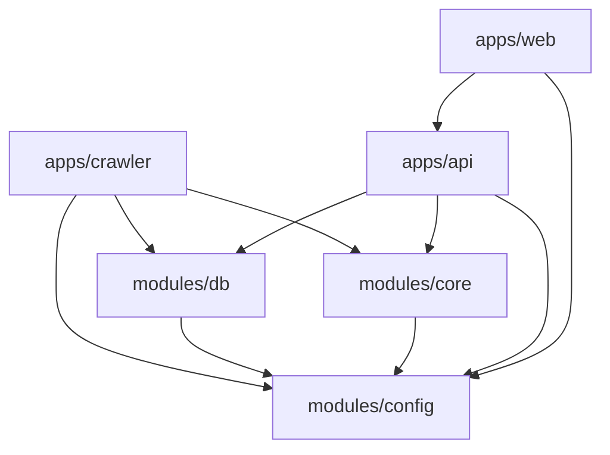

# 📁 Acta Project Structure Specification

**Version:** 1.0  
**Last Updated:** 2025-11-11  
**Owner:** Caio Vaccaro  

---

## 🧭 Overview

Acta is organized as a **TypeScript monorepo** composed of three deployable applications and four shared logic modules.  
The system ingests and analyzes news content using a Crawlee-based ingestion layer, a Fastify API, and a Next.js web frontend.  
All share a PostgreSQL (RDS) + pgvector database.

### Core technologies
- **Language:** TypeScript / Node.js 20+
- **Frontend:** Next.js 14 + Tailwind + shadcn/ui
- **Backend API:** Fastify
- **Crawler:** Crawlee + RSS feeds
- **Database:** PostgreSQL (AWS RDS) + pgvector
- **ORM:** Prisma
- **Hosting:** AWS (RDS, EC2/Fargate or Render/Fly.io)
- **Package manager:** pnpm workspaces

---

## 🏗️ Root layout

```text
acta/
  apps/
    api/
    web/
    crawler/
  modules/
    db/
    core/
    config/
    shared/
  infra/
    docker/
    aws/
  .env
  .env.local
  package.json
  pnpm-workspace.yaml
  tsconfig.base.json
  README.md
```

### Description

| Directory / File | Purpose |
|------------------|----------|
| `apps/` | Deployable runtimes (API, frontend, crawler) |
| `modules/` | Shared domain logic and utilities |
| `infra/` | Infrastructure and environment configuration |
| `.env` / `.env.local` | Environment variables |
| `pnpm-workspace.yaml` | Workspace declaration for monorepo |
| `tsconfig.base.json` | Base TS config inherited by all projects |

---

## 📦 apps/ — Executable Applications

### `/apps/api`
**Purpose:** Core backend exposing REST endpoints and serving computed consensus data.

```text
apps/api/
  src/
    index.ts
    server.ts
    routes/
      topics.ts
      debate.ts
      transparency.ts
      feedback.ts
    services/
      consensusService.ts
      topicsService.ts
      feedbackService.ts
    middleware/
      auth.ts
      errorHandler.ts
  package.json
  tsconfig.json
```

**Responsibilities**
- Serve `/topics`, `/verdict`, `/consensus-thermometer`, `/debate`, `/transparency`, `/feedback`
- Integrate with `modules/db` (Prisma)
- Use `modules/core` for consensus and analysis logic
- Expose health checks and admin endpoints

---

### `/apps/web`
**Purpose:** Public Next.js frontend for displaying consensus data and calls to action.

```text
apps/web/
  app/
    page.tsx
    topics/[id]/page.tsx
  components/
    VerdictCard.tsx
    ConsensusThermometer.tsx
    DebateCard.tsx
    TransparencyTable.tsx
    PickYourCauseWizard.tsx
  lib/
    apiClient.ts
    theme.ts
  package.json
  tsconfig.json
  next.config.js
  tailwind.config.js
  postcss.config.js
```

**Responsibilities**
- Render Verdict Cards, Debate Cards, and Thermometers
- Provide “Pick Your Cause” flow
- Consume `/api` endpoints through `apiClient`
- Styled with Tailwind + shadcn/ui

---

### `/apps/crawler`
**Purpose:** Automated ingestion and processing of news articles via RSS and Crawlee.

```text
apps/crawler/
  src/
    config/outlets.ts
    rss/fetchFeeds.ts
    crawlers/articleCrawler.ts
    jobs/refreshFeeds.ts
    mappers/articleMapper.ts
  package.json
  tsconfig.json
```

**Responsibilities**
- Fetch and parse RSS feeds
- Deduplicate articles
- Crawl and extract article content
- Store structured data into Postgres
- Run periodically (cron / GitHub Action / AWS scheduled job)

---

## 🧩 modules/ — Shared Logic

### `/modules/db`
**Purpose:** Prisma ORM schema and database access layer.

```text
modules/db/
  prisma/
    schema.prisma
    migrations/
  src/
    client.ts
    repositories/
      articlesRepo.ts
      outletsRepo.ts
      consensusRepo.ts
      feedbackRepo.ts
  package.json
  tsconfig.json
```

**Responsibilities**
- Define all entities (`Outlet`, `Article`, `Analysis`, `Consensus`, `Feedback`)
- Connect to Postgres / RDS
- Expose reusable repository methods
- Integrate pgvector for semantic search

---

### `/modules/core`
**Purpose:** Domain logic and computation utilities.

```text
modules/core/
  src/
    consensus/
      computeConsensus.ts
    analysis/
      stanceLabels.ts
      unknowns.ts
    llm/
      prompts.ts
      types.ts
```

**Responsibilities**
- Verdict computation (support share, variance, confidence)
- Stance labeling and normalization
- LLM prompt templates for stance, debate, and unknown extraction
- Pure, testable logic with no I/O

---

### `/modules/config`
**Purpose:** Configuration and environment validation.

```text
modules/config/
  src/
    env.ts
    constants.ts
```

**Responsibilities**
- Parse and validate environment variables
- Store project-wide constants (topics, thresholds, refresh windows)

---

### `/modules/shared`
**Purpose:** Shared DTOs, types, and cross-app definitions.

```text
modules/shared/
  src/
    dtos/
      VerdictCardDTO.ts
      ConsensusThermometerDTO.ts
      DebateCardDTO.ts
    apiTypes.ts
    events.ts
```

**Responsibilities**
- Define data contracts between API, Web, and Crawler
- Prevent schema drift across apps

---

## ⚙️ infra/ — Infrastructure & Environment

```text
infra/
  docker/
    docker-compose.yml
    db.Dockerfile
  aws/
    rds.tf
    ecs-api.tf
    ecs-crawler.tf
  scripts/
    migrate.sh
```

**Responsibilities**
- Local development via Docker (Postgres + pgvector)
- AWS Terraform or CloudFormation for RDS and ECS deployment
- Scripts for DB migration and CI/CD hooks

---

## 🧱 Generated vs. Manual Elements

| Type | Example | Generated By |
|------|----------|---------------|
| `apps/web` base files | `npx create-next-app web --ts` | Next.js CLI |
| `apps/web/tailwind.config.js` | via `npx tailwindcss init -p` | Tailwind CLI |
| `apps/crawler` starter | `npx crawlee create crawler` | Crawlee CLI |
| `modules/db/prisma/schema.prisma` | `npx prisma init` | Prisma CLI |
| `modules/db/prisma/migrations/` | `npx prisma migrate dev` | Prisma |
| Build folders (`.next/`, `storage/`, `node_modules/`) | automatic | frameworks / package manager |
| All other folders (`modules/core`, `modules/config`, etc.) | manual | created by developer |

---

## 🧾 Conventions

- **Naming:** all modules importable as `@acta/<module>` via workspace aliases.
- **TypeScript:** strict mode; `tsconfig.base.json` defines shared compiler options.
- **Env handling:** centralized in `modules/config/env.ts`.
- **Logging:** minimal structured logs (pino for API, Crawlee’s built-in logger).
- **Testing:** Jest or Vitest recommended in `modules/core` and `apps/api`.

---

## 🧩 Example import relationships



---

## ✅ Summary

This structure ensures:
- Clear separation between runtime apps and reusable logic.  
- One consistent environment across local and AWS.  
- Simple CI/CD orchestration (per app).  
- Extensibility for adding future modules (e.g., analytics, admin).  

All new agents or developers should adhere to this folder layout and naming convention when creating new components or services.
